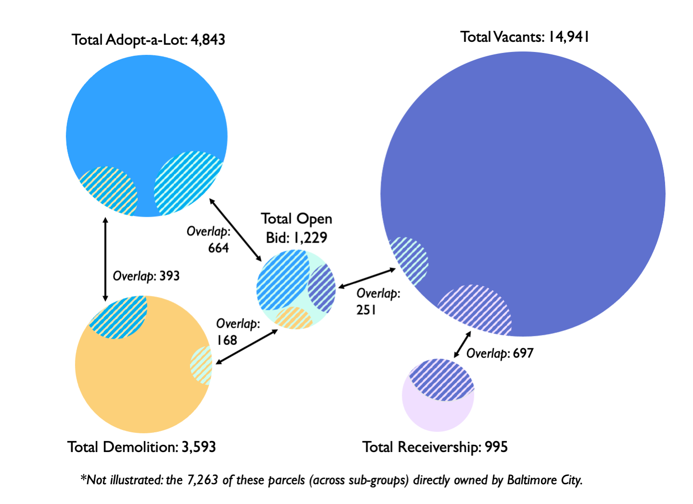

# Analysis of Vacant Lots in Baltimore City
### Camille Wathne, May 2022
### Maxwell School at Syracuse University

____
## Motivation

The population of Baltimore is in decline, from a peak of approximately 1 million residents in 1950 to 600,000 today. The city is therefore grappling with thousands of vacant buildings and empty parcels of land (hereafter referred to as “vacants”). Evidence shows that vacants have adverse impacts on health, neighborhood cohesion, and safety. In response, Baltimore City has implemented a range of programs intended to mitigate the negative effects of vacants, encourage building stewardship, and promote economic vitality. 

I completed this project as part of my master's level coursework at the Maxwell School of Syracuse University. 

### This project aims to:
- Characterize the neighborhoods that have a high portion of vacants
- Analyze the intersection and overlap of multiple Baltimore City policies to address vacants, including five programmatic interventions as well as direct city ownership
- Visually depict these relationships to better understand how these policies play out 

### Terms

**Vacants:** Coded by the city as any building that has been abandoned or has multiple outstanding violations. These lots may or may not appear in one of the 4 "programs" outlined below.

**Adopt-A-Lot:** Program that enables citizens to adopt/steward designated empty plots of land for private use.  

**Open-Bid:** Program that enables citizens to purchase certain vacant parcels; includes "Vacants to Value" program.   

**Receivership:** Program that encompasses a suite of targeted city activities intended to preserve and sustain “middle market neighborhoods.” Consists of targeted housing code enforcement; issuance of citations for negligence; seizure of properties; and legal transfer of deed to new receiving entity.  

**Demolition:** Includes city sponsored, targeted demolition of abandoned or neglected properties.

**City Ownership:** Sub-category of parcels that include "Mayor" and/or "City Council" in Owner field of real property records.  

Script 3 (detailed below) produces numerical outputs describing the extent of overlap between these programs and parcel subsets. The graphic below depicts the primary areas of overlap. 

___
## Instructions

This project uses Python to clean and merge datasets; QGIS to build maps; and Tableau to make the final neighborhood-level results accessible to a wider audience. I also used Stata for a different course to conduct a multivariate regression analysis on key demographic indicators and program occurance (not included in this repository).  

### Python Files  
The following files should be run in order. Each script produces outputs automatically saved in sub-folders, with some files being used in subsequent scripts.  

**1.DataClean.py:** Pulls in original, parcel-level data files from "Source Files" folder. See below for details on the origin and type of datasets. Cleans data, describes and characterises duplicates, produces program counts, codes binary value for each program participation, and prepares cleaned csv files which save to "Cleaned Files" folder and are used in subsequent scripts.  

**1b.InitialAnalysis.py:** Optional script that conducts intial program-specific analysis from cleaned csv files (eg housing typology, neighborhood prevalence, primary property owners). Output graphs are saved in folder titled "Initial Analysis_Chart Outputs."  

**2.AggregateData.py:** Aggregates cleaned, parcel-level csv files and merges on unique Block Lot identifer to create compiled sheet. Produces compiled_parcels csv file which saves to folder "Aggregated Files."  

**3.AggDataAnalysis.py:** Conducts analysis on combined parcel file; examines parcel overlap and program co-occurance. Produces neighborhood_parcel_agg file, organized by neighborhood, to prepare for merge with neighborhood-level data.  
**.NeighborhoodData.py:** Merges neighborhood-level census information, csv files titled "city_data_pdf" which includes manually coded median income data, and grouped program information from previous scripts. Produces final csv file, "neighborhood_full_data," which is saved in the main repository.  

**5.QGISprep.py:** Uses neighborhood_full_data.csv to produce neighborhood-level percentages in preparation for QGIS. Produces baltimore_shp.gpkg file, saved to "QGIS Files" folder.  

## Description of Source Files used in Python Code  
**real_property.csv:** Detailed information on all parcels in Baltimore City. Downloaded from Open Baltimore in March 2022: https://data.baltimorecity.gov/ 

**adopt_a_lot.csv:** Parcel-level information on lots available for adoption by Baltimore City. Downloaded from the Department of Housing and Community Development (DHCD) "Development Map" in March 2022: https://baltimoredhcd.maps.arcgis.com/apps/webappviewer/index.html?id=4f12adf6e5b1475b838f8bf284da1e67  

**vacants.csv:** Parcel-level information on properties coded as vacant. Downloaded from the DHCD's "Development Map" in March 2022: https://baltimoredhcd.maps.arcgis.com/apps/webappviewer/index.html?id=4f12adf6e5b1475b838f8bf284da1e67 * *Note: script 3 aggregates parcels coded as vacant in vacants.csv as as vacant in real_property.csv to produce an unduplicated count for the final analysis.* *  

**receivership.csv:** Parcel-level information on properties in some stage of the receivership process. Downloaded from the DHCD's "Development Map" in March 2022: https://baltimoredhcd.maps.arcgis.com/apps/webappviewer/index.html?id=4f12adf6e5b1475b838f8bf284da1e67  

**receivership_expand:** Parcel-level information on properties that are currently or have been through the receivership process. Downloaded from Open Baltimore in March 2022: https://data.baltimorecity.gov/ * *Note: script 1 aggregates these two receivership data sets to produce an unduplicated count for the final analysis of any parcel in receivership over the past 10 years.* *  

**open_bid.csv:** Parcel-level information on properties available to the public. Downloaded from the DHCD's "Development Map" in March 2022: https://baltimoredhcd.maps.arcgis.com/apps/webappviewer/index.html?id=4f12adf6e5b1475b838f8bf284da1e67  

**demo.csv:** Parcel-level information on properties that are slated for demolition or have already been demolished. Downloaded from Open Baltimore in March 2022: https://data.baltimorecity.gov/ * *Note: script 1 drops any parcel that has undergone demolition more than 10 years ago.* *  

**neighborhoods.csv:** Neighborhood-level information on Baltimore-City defined neighborhood tracts; includes demographic data from 2020 census. The translation process from census-defined tracts to city-defined neighborhoods was completed by Baltimore City. Downloaded from Open Baltimore in March 2022: https://data.baltimorecity.gov/  

**city_data_pdf:** Due to the absence of median income information from the neighborhood csv file, I manually entered economic information from neighborhood-level PDF documents composed by the city and found here: https://baltplanning.maps.arcgis.com/apps/webappviewer/index.html?id=d45903fd0a9e4132903920526fcafac7 This data is also from the 2020 census and went through the same translation process as the demographic data in neighborhoods.csv.

### QGIS Files
**shapefile_redlined1937.zip:** Outlines zones defined by the federally sponsored Home Owner's Loan Corporation to promote or prevent mortgage lending in certain city areas (ie "redlining"), with majority Black areas usually deemed as "hazardous." These designations are widely recognized as establishing and legally codifying racial segregation in U.S. cities. Downloaded from the University of Richmond's Mapping Inequality project: https://dsl.richmond.edu/panorama/redlining/#loc=11/39.293/-76.809&city=baltimore-md  

**baltimore_shp.gpkg:** Built in python script 5 for use in QGIS.  

**Baltimore Neighborhood Map.gqz:** QGIS workbook used to produce maps in "Maps" subfolder. 

## Tableau 
Certain neighborhood-level indicators are visualized in Tableau, found here: https://public.tableau.com/app/profile/camille.wathne/viz/BaltimoreVacantAnalysis/ByAnyProgram?publish=yes 

